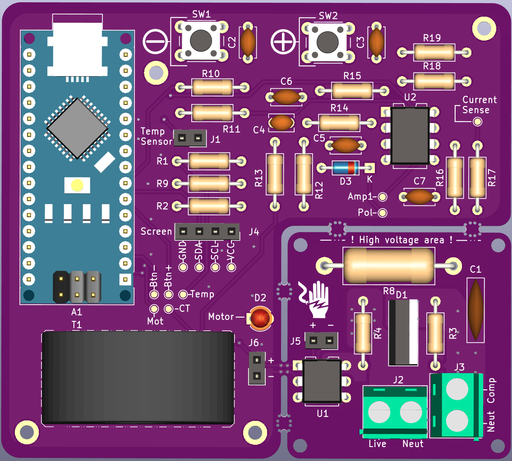
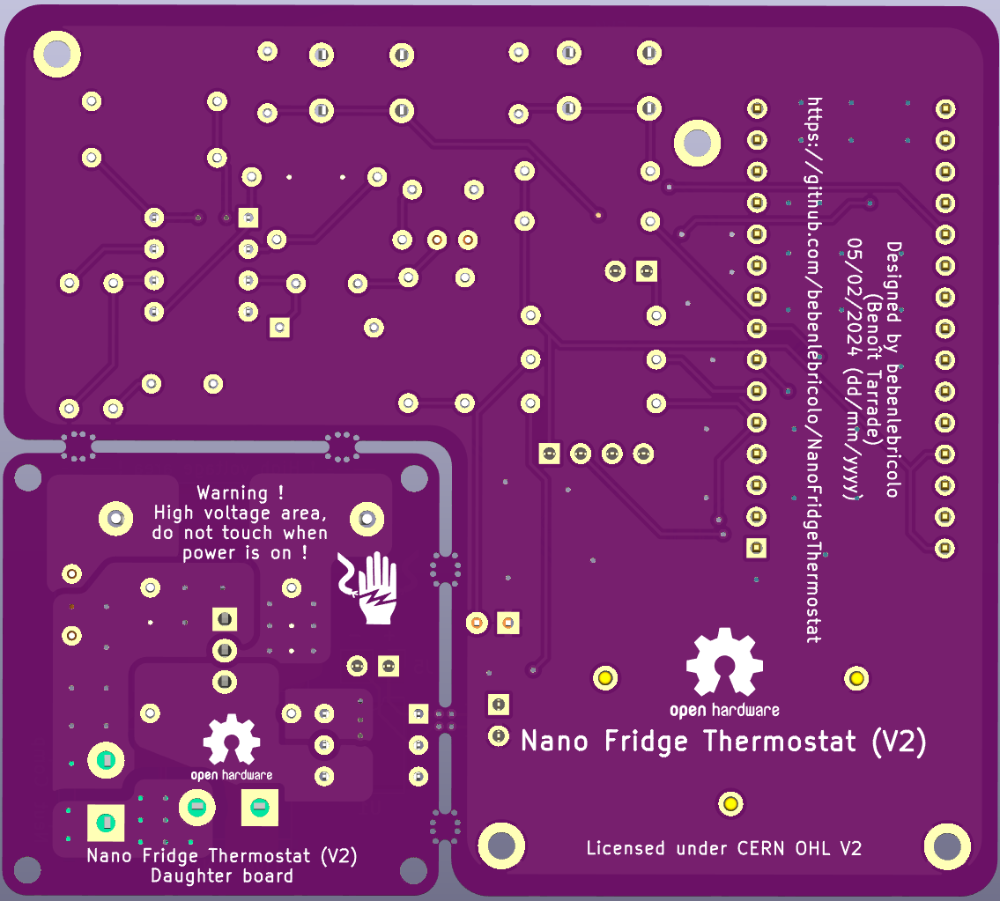
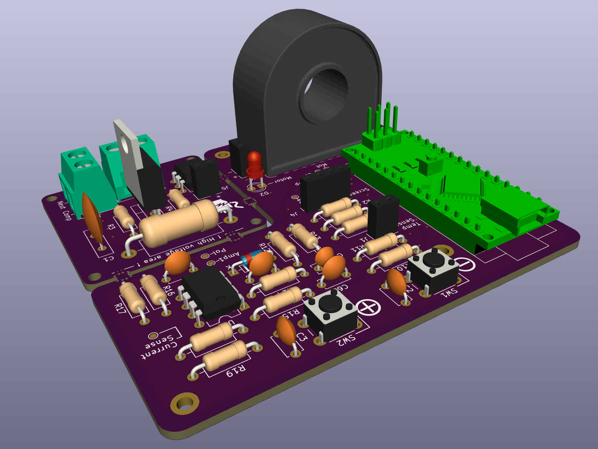

# Readme's Index
- [Readme's Index](#readmes-index)
- [Nano Fridge Thermostat](#nano-fridge-thermostat)
- [Nano Thermostat V2](#nano-thermostat-v2)
- [Git submodules setup (Optional, used for hardware development)](#git-submodules-setup-optional-used-for-hardware-development)
  - [Screenshots (view taken before manufacturing)](#screenshots-view-taken-before-manufacturing)
- [Hardware design](#hardware-design)
  - [Simulations](#simulations)
  - [Electronic design](#electronic-design)
    - [Mother board](#mother-board)
    - [Daughter board (AC power board)](#daughter-board-ac-power-board)
  - [Tools](#tools)
    - [Thermistor data source files generator](#thermistor-data-source-files-generator)
    - [Resistor bridge calculator](#resistor-bridge-calculator)
- [Tests](#tests)
  - [Building the tests](#building-the-tests)
  - [Tests dependencies](#tests-dependencies)
- [Acknowledgment](#acknowledgment)


# Nano Fridge Thermostat
Welcome to the Nano Fridge project !
This project started up because my fridge thermostat was dying (actually it was pretty dead and noticed the fridge was not cooling anymore) and I needed to find something very quickly in order to keep it running a bit longer.
It's aimed at replacing the cheap (but very reliable) thermomechanical switch that's used in most low-end fridges.

The very first revision operated on an Arduino Nano and used regular relays to perform its task.
It was essentially an Open-Loop system, running the compressor for 1 hour, and letting it rest for 2 hours.
This Open Loop process works fine but does not take into account the internal temperature of the fridge.
Hence, the actual temperature was oscillating a lot between 2 or 3°C and 6 to 8°C, depending on how many times we would open it.

The first revision of this project can be found on tag V1.0.0

# Nano Thermostat V2
A newer revision of the thermostat is currently in the works and several small improvements will be provided :
* Safe compressor start up procedure
* Thermistor support (NTC)
* Closed-Loop control algorithms (very simple hysteresis at first)
* Screen and buttons to monitor and setup the fridge parameters from outside the fridge.

More details can be found in the [NanoThermostat-V2](NanoThermostat-V2) folder.

A custom PCB was designed for this board (as the electrical design became more and more crowded with components and functionalities).
It can be found under the [Hardware](Hardware/) folder, and I used KiCAD 7 to design the boards.

# Git submodules setup (Optional, used for hardware development)
In order for this project to be usable (especially to get all the footprints here), you'll need to initialise and download git submodules.
This can be done like so :
```bash
git submodule update --init --recursive
```

## Screenshots (view taken before manufacturing)
<figure>
    
    <figcaption>Board V2.0.0, Front</figcaption>
</figure>
<figure>
    
    <figcaption>Board V2.0.0, Back</figcaption>
</figure>
<figure>
    
    <figcaption>Board V2.0.0, Iso</figcaption>
</figure>

# Hardware design
As said, these boards were designed with KiCAD 7 which is a free open source software.
You'll need a copy of it installed on your machine in order to open hardware files.

## Simulations
Some simulations were used in this project as well and can be found under [Hardware/Simulations](Hardware/Simulations/).
Those simulations were performed with the very good LTSpice tool, released publicly and for free by Linear Technologies.
Despite not being open source per se, this tool can be installed on Linux as well using Wine wrappers.

## Electronic design
This new board (V2.0.0) includes 2 boards attached by small tabs. One of them carries the signal that goes to the triac driver. They are designed to be manually snapped, as the daughter board (the smaller one) needs to be galvanically isolated from the mother board.

### Mother board
The mother board carries and Arduino Nano V3 and works with low voltages (5V).
Power is supplied via the Arduino's USB connector and the system is designed to consume very little power (less than 100mA, most probably around 30/50 mA)

It's main features are :
* AC current sense : used to sense the current that goes into the fridge compressor
  * Used mainly as a security feature as it allows to detect conditions where the fridge compressor is stalled (when power cycling the compressor in time interval shorter than around 5 minutes, cooling fluids prevent the motor to start, hence pulling a large amount of current for an extended period of time, causing coil overheating).
  * This security feature is mostly intended to cover the cases where general power is cut off and quickly returns to normal. Microcontroller will reboot under such conditions and as there is no embedded RTC, there is no means to tell how long the power cut was, potentially causing the board to trigger the motor again. Monitoring pulled current can help detect such conditions and allow to delay compressor operation enough to get back under normal working conditions.
* Fridge compressor control using zero crossing detection (triac driver + triac)
* Fridge temperature sensing using NTC thermistor.
* I2C connector so that we can extend the board functionalities by plugging in a LCD screen.
* 2 buttons to control the boards behavior (forecasted roles were + and - buttons to lower or raise set point temperature, and reset internal memory.)

> Note : this board can easily be leveraged to control other small AC appliances ; as long as the triac is adapted to the target's power requirements. One will need to also adapt the 2 stages amplifier for the current sensing return loop in order to adapt to larger currents (and potentially adapt the Current Transformer as well).

### Daughter board (AC power board)
This small board can be detached from the mother board using the provided "mouse bites".
Usually, this board will be placed close to the compressor, in a well ventilated area to accommodate for the triac's heat under working conditions, whereas the mother board will be placed further.

It carries the triac driver (which is optoisolated) and the triac itself ([FT0814MH](https://docs.rs-online.com/2b24/0900766b8150e268.pdf), which is actually a Fagor specific item, specially crafted for fridges).
It's main role is then to switch the power on and off of the fridge's compressor.

## Tools
### Thermistor data source files generator
This repository embeds a small python ([thermistor_generator.py](Tools/thermistor_generator.py)) script whose purpose is to generate C source files for a given thermistor. It uses the basic parameters for a NTC thermistor :
* R0 : base resistance of the thermistor, at room temperature (usually, 25°Celsius)
* Beta constant : temperature constant, rated in Kelvin, for this thermistor
* name of the generated source files

It generates the default profile for an NTC thermistor, which needs to be compiled in the project in order to be used.
It's used through the small [thermistor.h](NanoThermostat-V2/thermistor.h) and [thermistor.c](NanoThermostat-V2/thermistor.c) module as the reference table for temperature reading.

Usage :
```bash
python thermistor_generator.py 100 3950 thermistor_ntc_100k_3950K --min -24 --max 25 --count 25
# 1 - Generating thermistor data
# 2 - Generating header file
# 3 - Generating source file
```
This generates files in the [Generated](Generated) folder.

### Resistor bridge calculator
This small python script ([resistor_bridge.py](Tools/resistor_bridge.py)) lets you calculate the ideal value for the upper resistor for a resistor bridge where a NTC thermistor is used as the lower part.
It finds the ideal value that maximizes the output voltage swing amplitude, based on the thermistor used temperature/resistance range.
Boosting the output voltage swing amplitude means that the Arduino's ADC will get a better resolution, hence better result as the usable voltage range is bigger.

Usage :
```bash
python resistor_bridge.py 100 1024
Ideal resistance value for R should be : 320.0
The unit (Ohms, KOhms, MOhms) is the same as input data
```

# Tests
This project embeds some tests projects.
Those tests are checking that the logic works on a desktop environment prior to be compiled and embedded on a tiny MCU.

## Building the tests
Runs with CMake :
```bash
cmake NanoThermostat-V2 -Bbuild
cd build/
make -j
```

## Tests dependencies
Googletest framework is used as a test framework and needs to be installed beforehand.
This is automatically done on Windows platforms (latest build zip is downloaded by CMake itself).
On Linux, a system-wide installation works very well :
```bash
pacman -S gtest # arch linux
apt-get install libgtest # Ubuntu/debian
```

# Acknowledgment
This repository uses open source software, tools and assets publicly available.

* [KiCAD](https://www.kicad.org/) 7.X
  * Used to develop the hardware/electronic design
* [FreeCAD](https://www.freecad.org/) 0.2XXX
* Used to develop the hardware/mechanical design
* [LTSpiceXVII](https://www.analog.com/en/resources/design-tools-and-calculators/ltspice-simulator.html) -> Available on Windows and Linux (via Wine, check your linux distribution packages).
  * Used to develop electronic simulations
* [kicad-lib-arduino](https://github.com/g200kg/kicad-lib-arduino)
  * Used as part of the hardware design process (mainly the Arduino Nano V3 3D model)
  * [Creative Common License : CC0 1.0 Universal](https://github.com/g200kg/kicad-lib-arduino/blob/main/LICENSE)
* [Panelization.pretty](https://github.com/madworm/Panelization.pretty)
  * Used as part of the hardware design process (used the mouse bites footprints)
  * No license for now (Feb 2024) ?
* [googletest](https://github.com/google/googletest)
  * Google's C/C++ unit testing framework
  * [BSD-3-Clause license](https://github.com/google/googletest/blob/main/LICENSE)